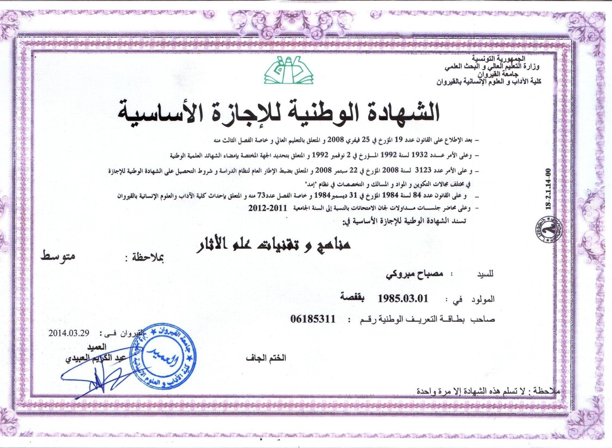
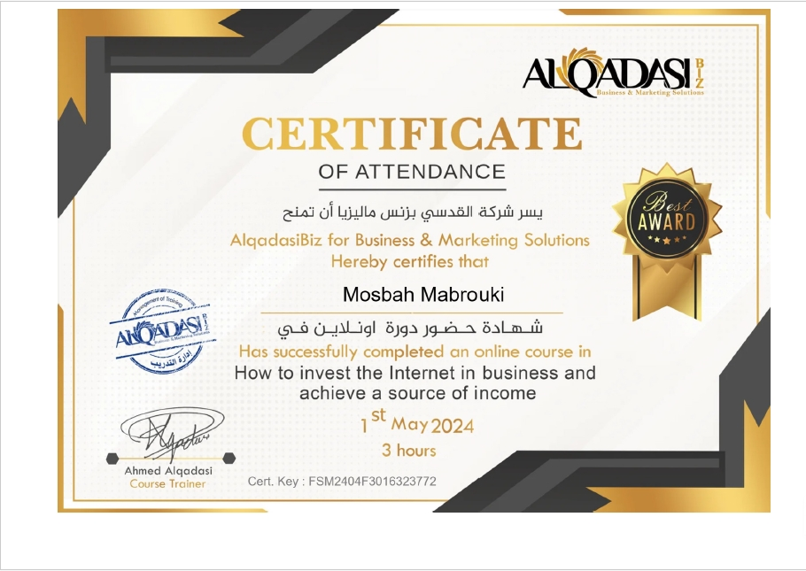
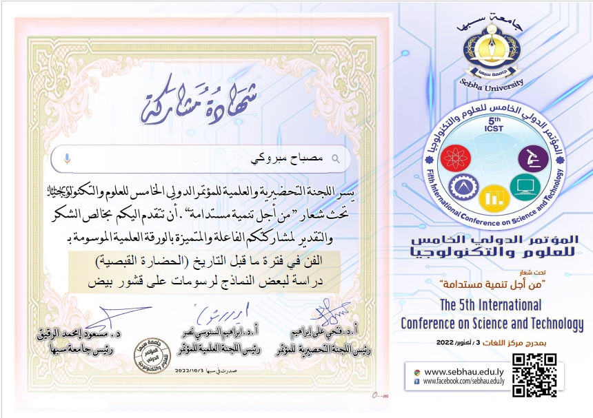
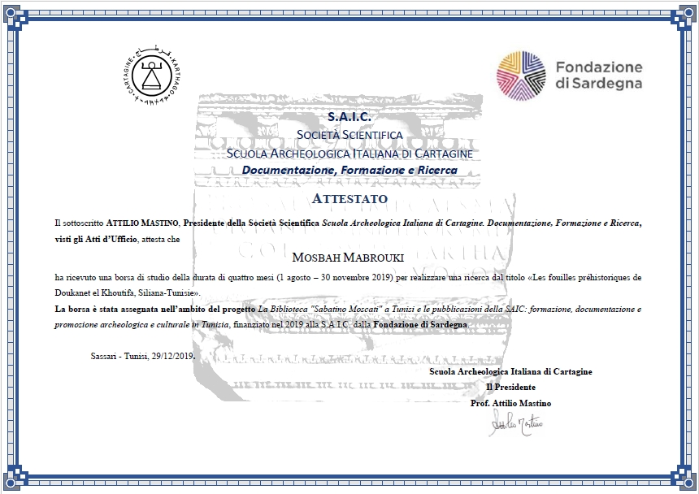

<!DOCTYPE html>
<html lang="ar">
<head>
    <meta charset="UTF-8">
    <meta name="viewport" content="width=device-width, initial-scale=1.0">
    <title>مصباح مبروكي - صفحة شخصية</title>
    <link rel="stylesheet" href="https://stackpath.bootstrapcdn.com/bootstrap/4.5.2/css/bootstrap.min.css">
	
    <link rel="stylesheet" href="https://cdnjs.cloudflare.com/ajax/libs/font-awesome/5.15.4/css/all.min.css">
    
</head>
<body>
    

        

            
            <h1 id="name-ar">مصباح مبروكي</h1>
            <h1 id="name-en" style="display: none;">Mosbah Mabrouki</h1>
			<h1 id="name-ru" style="display: none;">Mosbah Mabrouki</h1>
			<h1 id="name-zh" style="display: none;">Mosbah Mabrouki</h1>
			<h1 id="name-de" style="display: none;">Mosbah Mabrouki</h1>
			<h1 id="name-tr" style="display: none;">Mosbah Mabrouki</h1>
            
 علم الآثار التجريبي ماقبل التاريخ
			تاريخ وعلم اثار و تراث و انثروبولوجيا 

            
 Experimental prehistoric archeology History, archeology, heritage and anthropology

			
 Экспериментальная доисторическая археология История, археология, наследие и антропология

			
 实验史前考古学 历史、考古学、遗产和人类学

			
 Experimentelle prähistorische Archäologie Geschichte, Archäologie, Kulturerbe und Anthropologie

			
 Deneysel tarih öncesi arkeoloji Tarih, arkeoloji, miras ve antropoloji

		<nav>
            <ul>
		
<i class="fab fa-orcid"></i> <a href="https://orcid.org/0009-0008-5925-2727" target="_blank"class="btn btn-orcid">ORCID</a>

        
<i class="fab fa-google"></i> <a href="https://scholar.google.com.ly/citations?user=JXUwyOAAAAAJ&hl=ar" target="_blank"class="btn btn-google Scholar">Google Scholar</a>

        
<i class="fab fa-researchgate"></i> <a href="https://www.researchgate.net/profile/Mosbah-Mabrouki-2" target="_blank"class="btn btn-ResearchGate">ResearchGate</a>

        
<i class="fas fa-graduation-cap"></i> <a href="https://flm.academia.edu/MosbahMabrouki" target="_blank"class="btn btn-Academia">Academia.edu</a>

            </ul>
        </nav>
	

	</section>
    
        
<header>
        <nav>
            <ul>
                <li><a href="#" class="lang-button"><button class="btn btn-secondary" onclick="toggleLang('ar')">العربية</button> </a></li>
				<li><a href="#" class="lang-button"><button class="btn btn-secondary" onclick="toggleLang('en')">English</button> </a></li>
				<li><a href="#" class="lang-button"><button class="btn btn-secondary" onclick="toggleLang('ru')">Русский</button> </a></li>
				<li><a href="#" class="lang-button"><button class="btn btn-secondary" onclick="toggleLang('zh')">中文</button> </a></li>
				<li><a href="#" class="lang-button"><button class="btn btn-secondary" onclick="toggleLang('de')">Deutsch</button> </a></li>
				<li><a href="#" class="lang-button"><button class="btn btn-secondary" onclick="toggleLang('tr')">Türkçe</button> </a></li>
            </ul>
        </nav>
    </header>
        

        

 
        <!-- Sections for "About Me" in different languages -->
<section class="container my-5" id="about-ar">
    <h2 class="section-title">عنّي</h2>
    
أكثر من 15 عامًا من الخبرة في الحفريات الأثرية، وتنظيم الندوات العلمية، وإعداد التقارير، والحفاظ على السرية المطلقة.
        لدي درجة الماجستير في التاريخ والحضارة، ودرجة البكالوريوس في علم الآثار، وخبرة في الإعلام المكتبي.
        أتطلع إلى الاستفادة من معرفتي وخبرتي في دور مدير مشروع.

</section>
<section class="container my-5" id="about-en" style="display: none;">
    <h2 class="section-title">About Me</h2>
    
More than 15 years of experience in archaeological excavations, organizing scientific seminars, preparing reports and maintaining absolute confidentiality.
        I have a master's degree in history and civilization, a bachelor's degree in archaeology, and experience in desktop media.
        I look forward to benefiting from my knowledge and experience in the role of Project Manager.

</section>
<section class="container my-5" id="about-ru" style="display: none;">
    <h2 class="section-title">Обо мне</h2>
    
Более 15 лет опыта в археологических раскопках, организации научных семинаров, подготовке отчетов и соблюдении абсолютной конфиденциальности.
        У меня есть степень магистра истории и цивилизации, степень бакалавра археологии и опыт работы в настольных СМИ.
        Я с нетерпением жду возможности использовать свои знания и опыт в роли менеджера проекта.

</section>
<section class="container my-5" id="about-zh" style="display: none;">
    <h2 class="section-title">关于我</h2>
    
在考古发掘、组织科学研讨会、准备报告和保持绝对保密方面拥有超过15年的经验。
        我拥有历史与文明的硕士学位、考古学学士学位，并具有桌面媒体的经验。
        我期待着在项目经理的角色中受益于我的知识和经验。

</section>
<section class="container my-5" id="about-de" style="display: none;">
    <h2 class="section-title">Über mich</h2>
    
Mehr als 15 Jahre Erfahrung in archäologischen Ausgrabungen, der Organisation wissenschaftlicher Seminare, der Erstellung von Berichten und der Wahrung der absoluten Vertraulichkeit.
        Ich habe einen Master-Abschluss in Geschichte und Zivilisation, einen Bachelor-Abschluss in Archäologie und Erfahrung in der Desktop-Medienarbeit.
        Ich freue mich darauf, mein Wissen und meine Erfahrung in der Rolle des Projektmanagers einzubringen.

</section>
<section class="container my-5" id="about-tr" style="display: none;">
    <h2 class="section-title">Hakkımda</h2>
    
15 yılı aşkın arkeolojik kazılar, bilimsel seminerler düzenleme, rapor hazırlama ve tam gizliliği sağlama deneyimine sahibim.
        Tarih ve Medeniyet alanında yüksek lisans, Arkeoloji alanında lisans diplomasına sahibim ve masaüstü medya alanında deneyimim var.
        Bilgi ve deneyimlerimi Proje Yöneticisi rolünde kullanmayı dört gözle bekliyorum.

</section>

<!-- Sections for "CV" in different languages -->
<section class="container my-5" id="cv-ar">
    <h2 class="section-title">السيرة الذاتية</h2>
    <embed src="Curriculum Vitae.pdf" type="application/pdf" width="70%" height="600px" />
</section>
<section class="container my-5" id="cv-en" style="display: none;">
    <h2 class="section-title">Curriculum Vitae</h2>
    <embed src="Curriculum Vitae.pdf" type="application/pdf" width="70%" height="600px" />
</section>
<section class="container my-5" id="cv-ru" style="display: none;">
    <h2 class="section-title">Резюме</h2>
    <embed src="Curriculum Vitae.pdf" type="application/pdf" width="70%" height="600px" />
</section>
<section class="container my-5" id="cv-zh" style="display: none;">
    <h2 class="section-title">简历</h2>
    <embed src="Curriculum Vitae.pdf" type="application/pdf" width="70%" height="600px" />
</section>
<section class="container my-5" id="cv-de" style="display: none;">
    <h2 class="section-title">Lebenslauf</h2>
    <embed src="Curriculum Vitae.pdf" type="application/pdf" width="70%" height="600px" />
</section>
<section class="container my-5" id="cv-tr" style="display: none;">
    <h2 class="section-title">Özgeçmiş</h2>
    <embed src="Curriculum Vitae.pdf" type="application/pdf" width="70%" height="600px" />
</section>

<!-- Sections for "Certificates" in different languages -->
<section class="container my-5" id="certificates-ar">
    <h2 class="section-title">الشهادات</h2>
    

        <!-- الشهادات العلمية -->
        

            <h3>الشهادات العلمية</h3>
            
            
            
        

        <!-- التربصات -->
        

            <h3>التربصات</h3>
            
            
            
        

        <!-- أنشطة مختلفة -->
        

            <h3>أنشطة مختلفة</h3>
            
            
            
        

    

</section>
<section class="container my-5" id="certificates-en" style="display: none;">
    <h2 class="section-title">Certificates</h2>
    

        <!-- Academic Certificates -->
        

            <h3>Academic Certificates</h3>
            
            
            
        

        <!-- Internships -->
        

            <h3>Internships</h3>
            
            
            
        

        <!-- Various Activities -->
        

            <h3>Various Activities</h3>
            
            
            
        

    

</section>
<section class="container my-5" id="certificates-ru" style="display: none;">
    <h2 class="section-title">Сертификаты</h2>
    

        <!-- Академические сертификаты -->
        

            <h3>Академические сертификаты</h3>
            
            
            
        

        <!-- Стажировки -->
        

            <h3>Стажировки</h3>
            
            
            
        

        <!-- Разные активности -->
        

            <h3>Разные активности</h3>
            
            
            
        

    

</section>
<section class="container my-5" id="certificates-zh" style="display: none;">
    <h2 class="section-title">证书</h2>
    

        <!-- 学术证书 -->
        

            <h3>学术证书</h3>
            
            
            
        

        <!-- 实习 -->
        

            <h3>实习</h3>
            
            
            
        

        <!-- 各种活动 -->
        

            <h3>各种活动</h3>
            
            
            
        

    

</section>
<section class="container my-5" id="certificates-de" style="display: none;">
    <h2 class="section-title">Zertifikate</h2>
    

        <!-- Akademische Zertifikate -->
        

            <h3>Akademische Zertifikate</h3>
            
            
            
        

        <!-- Praktika -->
        

            <h3>Praktika</h3>
            
            
            
        

        <!-- Verschiedene Aktivitäten -->
        

            <h3>Verschiedene Aktivitäten</h3>
            
            
            
        

    

</section>
<section class="container my-5" id="certificates-tr" style="display: none;">
    <h2 class="section-title">Sertifikalar</h2>
    

        <!-- Akademik Sertifikalar -->
        

            <h3>Akademik Sertifikalar</h3>
            
            
            
        

        <!-- Stajlar -->
        

            <h3>Stajlar</h3>
            
            
            
        

        <!-- Çeşitli Aktiviteler -->
        

            <h3>Çeşitli Aktiviteler</h3>
            
            
            
        

    

</section>

<!-- Sections for "Books & Publications" in different languages -->
<section class="container my-5" id="books-ar">
    <h2 class="section-title">الكتب والمنشورات</h2>
    <ul>
        <li><a href="https://www.amazon.com/dp/B0B9X4G6NH" target="_blank">الكتابي</a></li>
        <li><a href="https://www.amazon.com/dp/B09LPQ6R3J" target="_blank">المنشور العلمي</a></li>
    </ul>
</section>
<section class="container my-5" id="books-en" style="display: none;">
    <h2 class="section-title">Books & Publications</h2>
    <ul>
        <li><a href="https://www.amazon.com/dp/B0B9X4G6NH" target="_blank">My Book</a></li>
        <li><a href="https://www.amazon.com/dp/B09LPQ6R3J" target="_blank">Scientific Publication</a></li>
    </ul>
</section>
<section class="container my-5" id="books-ru" style="display: none;">
    <h2 class="section-title">Книги и публикации</h2>
    <ul>
        <li><a href="https://www.amazon.com/dp/B0B9X4G6NH" target="_blank">Моя книга</a></li>
        <li><a href="https://www.amazon.com/dp/B09LPQ6R3J" target="_blank">Научная публикация</a></li>
    </ul>
</section>
<section class="container my-5" id="books-zh" style="display: none;">
    <h2 class="section-title">书籍与出版物</h2>
    <ul>
        <li><a href="https://www.amazon.com/dp/B0B9X4G6NH" target="_blank">我的书</a></li>
        <li><a href="https://www.amazon.com/dp/B09LPQ6R3J" target="_blank">学术出版物</a></li>
    </ul>
</section>
<section class="container my-5" id="books-de" style="display: none;">
    <h2 class="section-title">Bücher & Veröffentlichungen</h2>
    <ul>
        <li><a href="https://www.amazon.com/dp/B0B9X4G6NH" target="_blank">Mein Buch</a></li>
        <li><a href="https://www.amazon.com/dp/B09LPQ6R3J" target="_blank">Wissenschaftliche Veröffentlichung</a></li>
    </ul>
</section>
<section class="container my-5" id="books-tr" style="display: none;">
    <h2 class="section-title">Kitaplar & Yayınlar</h2>
    <ul>
        <li><a href="https://www.amazon.com/dp/B0B9X4G6NH" target="_blank">Kitabım</a></li>
        <li><a href="https://www.amazon.com/dp/B09LPQ6R3J" target="_blank">Bilimsel Yayın</a></li>
    </ul>
</section>
<!--section id="contact"-->
    <!-- Arabic -->
    <form>
        

            <label for="name">İsim*Имя*الاسم*Name*姓名*Name</label>
            <input type="text" class="form-control" id="name" name="name" required>
        

        

            <label for="email">E-posta*Электронная почта*البريد الإلكتروني*Email*电子邮件*E-Mail</label>
            <input type="email" class="form-control" id="email" name="email" required>
        

        

            <label for="message">Mesaj*Сообщение*الرسالة*Message*消息*Nachricht</label>
            <textarea class="form-control" id="message" name="message" rows="4" required></textarea>
        

        <button type="submit" class="btn btn-submit">Gönder*Отправить*إرسال*Send*发送*Senden</button>
    </form>
  
</section>
<!-- Footer -->
<footer class="bg-dark text-light text-center py-4">
    
&copy; 2024 Mosbah Mabrouki. جميع الحقوق محفوظة.

    
	
هاتف:phone <a href="tel:+21621705272" class="text-light">+216 21 70 52 72</a> | واتساب:WhatsApp <a href="https://wa.me/+21621705272" class="text-light">+216 21 70 52 72</a>

</footer>

<!-- JavaScript for language switching -->

<!-- Font Awesome Icons -->

</body>
</html>
 

        <!-- Page Content -->
        

        <!-- Other sections remain unchanged -->
        
        <!-- Footer -->
 <footer class="container my-5">
            
تابعني على:

            <a href="https://www.linkedin.com/in/mosba7-mabrouki/" class="btn btn-primary">
                <i class="fab fa-linkedin"></i> LinkedIn
            </a>
            <a href="https://github.com/mosbah-mabrouki" class="btn btn-dark">
                <i class="fab fa-github"></i> GitHub
            </a>
            <a href="https://x.com/mosbahmabrouki" class="btn btn-info">
                <i class="fab fa-twitter"></i> Twitter
            </a>
            <a href="https://www.facebook.com/mosbah7mabrouki.7/" target="_blank" class="btn btn-info">
                <i class="fab fa-facebook"></i> Facebook
            </a>
			<a href="https://www.youtube.com/user/yourchannel" class="btn btn-danger">
                <i class="fab fa-youtube"></i> YouTube
            </a>
            <a href="https://www.tiktok.com/@yourprofile" class="btn btn-dark">
                <i class="fab fa-tiktok"></i> TikTok
            </a>
            <a href="https://www.instagram.com/yourprofile" class="btn btn-danger">
                <i class="fab fa-instagram"></i> Instagram
			</a>
			<a href="https://wa.me/+21621705272" class="btn btn-success">
                <i class="fab fa-whatsapp"></i> WhatsApp
            </a>
            
			<a href="tel:+21621705272" class="btn btn-danger">
                <i class="fas fa-phone"></i> +21621705272اتصل بي
            </a>
            
        </footer>
    

		<!-- Scroll to Top Button -->
        <button id="scroll-to-top" class="btn btn-primary" onclick="window.scrollTo({ top: 0, behavior: 'smooth' });">↑</button>
		<!-- Footer -->
        <footer class="container my-5 text-center">
            
&copy; 2024 Mosbah Mabrouki. All rights reserved.

		

		
    

    
</body>
</html>
        
